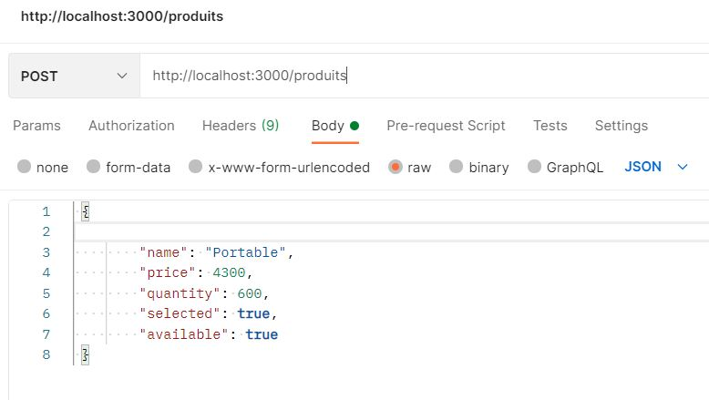

# Application V4 utlisant le framework angular 11  ( projet avec décomposition de composants et utlisation de ngRX )

https://www.javatuto.com/angular/angular-ngrx-commencez-avec-ngrx/

NgRx est un groupe de bibliothèques inspiré du modèle Redux. Comme son nom l’indique, NgRx est écrit spécifiquement pour les applications Angular en tant que solution de gestion d’état.


Pour commencer, NgRx signifie Angular Reactive Extensions. NgRx est un système de gestion d’état basé sur le modèle Redux. Avant d’aller plus loin dans les détails, essayons de comprendre le concept d’état dans une application angular.

#### Etat ( State)

 ngrx est un service
 ````shell script
λ ng g s services/event.driver
CREATE src/app/services/event.driver.service.spec.ts (387 bytes)
CREATE src/app/services/event.driver.service.ts (141 bytes)
````

https://ultimatecourses.com/blog/angular-ngfor-async-pipe


## Application angular 11


## Angular version
````angular2
C:\PERSONNEL\tools\cmder
λ ng --version

     _                      _                 ____ _     ___
    / \   _ __   __ _ _   _| | __ _ _ __     / ___| |   |_ _|
   / △ \ | '_ \ / _` | | | | |/ _` | '__|   | |   | |    | |
  / ___ \| | | | (_| | |_| | | (_| | |      | |___| |___ | |
 /_/   \_\_| |_|\__, |\__,_|_|\__,_|_|       \____|_____|___|
                |___/


Angular CLI: 11.2.6
Node: 14.16.0
OS: win32 x64

Angular:
...
Ivy Workspace:

Package                      Version
------------------------------------------------------
@angular-devkit/architect    0.1102.6 (cli-only)
@angular-devkit/core         11.2.6 (cli-only)
@angular-devkit/schematics   11.2.6 (cli-only)
@schematics/angular          11.2.6 (cli-only)
@schematics/update           0.1102.6 (cli-only)

````

## Creation d'un projet angular

````shell script
C:\PERSONNEL\eclipse-workspace-java-training\Dveloppement-Web-Front-End-Angular-11 (main -> origin)
λ ng new web-catalog-application-angular11
? Do you want to enforce stricter type checking and stricter bundle budgets in the workspace?
  This setting helps improve maintainability and catch bugs ahead of time.
  For more information, see https://angular.io/strict Yes
? Would you like to add Angular routing? Yes
? Which stylesheet format would you like to use? CSS
CREATE web-catalog-application-angular11/angular.json (3839 bytes)
CREATE web-catalog-application-angular11/package.json (1223 bytes)
````


## Dependances


###  json-server dependance

Get a full fake REST API with zero coding in less than 30 seconds (seriously)
Created with <3 for front-end developers who need a quick back-end for prototyping and mocking. https://github.com/typicode/json-server

nous utlisons le fichier db.json

installation 
se position sur le projet puis installé la dependance


````shell script
λ npm install -save json-server
λ npm install -save bootstrap
λ npm install --save jquery
λ npm install --save font-awesome
λ npm install --save popper.js
````


### Concurrently dependance

````shell script
λ npm install --save  concurrently
````

modifier le fichier **package.json** comme suit.

````shell script
{
  "name": "web-catalog-application-angular11",
  "version": "0.0.0",
  "scripts": {
    "ng": "ng",
    #"start": "ng serve ",
    "start": "concurrently \"ng serve\" \"json-server --watch db.json\"",
    "build": "ng build",
    "test": "ng test",
    "lint": "ng lint",
    "e2e": "ng e2e"
  }
....


## Demarrage du json-server fake


````shell script
> concurrently "ng serve" "json-server --watch db.json"

[1]
[1]   \{^_^}/ hi!
[1]
[1]   Loading db.json
[1]   Done
[1]
[1]   Resources
[1]   http://localhost:3000/produits
[1]
[1]   Home
[1]   http://localhost:3000
[1]
[1]   Type s + enter at any time to create a snapshot of the database
[1]   Watching...
[1]
````

- pour acceder à la base de donné fake utiliser l'url suivante  **http://localhost:3000/produits**

````json
GET http://localhost:3000/produits
[
{
id: 1,
name: "Computer",
price: 4300,
quantity: 600,
selected: true,
available: true
},
{
id: 2,
name: "Printer",
price: 300,
quantity: 100,
selected: true,
available: true
},
{
id: 3,
name: "Smartphone",
price: 1200,
quantity: 100,
selected: true,
available: true
}
]
````

````json
GET http://localhost:3000/produits/1
{
id: 1,
name: "Computer",
price: 4300,
quantity: 600,
selected: true,
available: true
}
````

Post



- pour acceder à l'application utiliser l'url suivante **http://localhost:4200**

## Changer le style et les scripts angular 
Modifier le fichier angular.json comme suit

````json
            "styles": [
              "src/styles.css",
              "./node_modules/bootstrap/dist/css/bootstrap.min.css"
            ],
            "scripts": [
              "./node_modules/jquery/dist/jquery.min.js",
              "./node_modules/popper.js/dist/umd/popper.min.js",
              "./node_modules/bootstrap/dist/js/bootstrap.min.js"
            ]
          }
````


## Composants angular


````shell script
λ ng g c components/products/products-nav-bar
CREATE src/app/components/products/products-nav-bar/products-nav-bar.component.html (31 bytes)
CREATE src/app/components/products/products-nav-bar/products-nav-bar.component.spec.ts (684 bytes)
CREATE src/app/components/products/products-nav-bar/products-nav-bar.component.ts (313 bytes)
CREATE src/app/components/products/products-nav-bar/products-nav-bar.component.css (0 bytes)
UPDATE src/app/app.module.ts (1256 bytes)

λ ng g c components/products/products-list
CREATE src/app/components/products/products-list/products-list.component.html (28 bytes)
CREATE src/app/components/products/products-list/products-list.component.spec.ts (669 bytes)
CREATE src/app/components/products/products-list/products-list.component.ts (302 bytes)
CREATE src/app/components/products/products-list/products-list.component.css (0 bytes)
UPDATE src/app/app.module.ts (1385 bytes)

----------------------------------------------------

 ng g c components/nav-bar
CREATE src/app/components/nav-bar/nav-bar.component.html (22 bytes)
CREATE src/app/components/nav-bar/nav-bar.component.spec.ts (627 bytes)
CREATE src/app/components/nav-bar/nav-bar.component.ts (278 bytes)
CREATE src/app/components/nav-bar/nav-bar.component.css (0 bytes)

https://www.w3schools.com/bootstrap4/bootstrap_navbar.asp

ng g c components/products
CREATE src/app/components/products/products.component.html (23 bytes)
CREATE src/app/components/products/products.component.spec.ts (640 bytes)
CREATE src/app/components/products/products.component.ts (283 bytes)
CREATE src/app/components/products/products.component.css (0 bytes)
UPDATE src/app/app.module.ts (589 bytes)

ng g c components/home
CREATE src/app/components/home/home.component.html (19 bytes)
CREATE src/app/components/home/home.component.spec.ts (612 bytes)
CREATE src/app/components/home/home.component.ts (267 bytes)
CREATE src/app/components/home/home.component.css (0 bytes)
UPDATE src/app/app.module.ts (674 bytes)

formulaire ( formBuilder) de saisie pour ajouter un nouveau produit
λ ng g c components/add-product
CREATE src/app/components/add-product/add-product.component.html (26 bytes)
CREATE src/app/components/add-product/add-product.component.spec.ts (655 bytes)
CREATE src/app/components/add-product/add-product.component.ts (294 bytes)
CREATE src/app/components/add-product/add-product.component.css (0 bytes)
UPDATE src/app/app.module.ts (967 bytes)


formulaire ( formBuilder) edition de produit
λ ng g c components/edit-product
CREATE src/app/components/edit-product/edit-product.component.html (27 bytes)
CREATE src/app/components/edit-product/edit-product.component.spec.ts (662 bytes)
CREATE src/app/components/edit-product/edit-product.component.ts (298 bytes)
CREATE src/app/components/edit-product/edit-product.component.css (0 bytes)
UPDATE src/app/app.module.ts (1084 bytes)
````


## Services angular
````shell script
ng g s services/products
CREATE src/app/services/products.service.spec.ts (367 bytes)
CREATE src/app/services/products.service.ts (137 bytes)
````

## Create classes Model
````shell script
ng generate interface  models/product --type=model
CREATE src/app/models/product.model.ts (30 bytes)
````

## Subscribe

Il existe deux methodes pour recuperer des données depuis une api de façon asynchrone

### Methode 1

  ````angular2
  public products: Product[] | null = null;
  ../..
  this.productsservice.getAllProducts().subscribe(data => {this.products = data; }, error => {console.log(error); });
````

````html
<div class="container" *ngIf="products">
  <table class="table">
    <tr>
      <th>ID</th><th>Name</th><th>Price</th><th>Quantity</th><th>Selected</th><th>Availabble</th>
    </tr>
    <tr *ngFor="let p of products">
       <td>{{p.id}}</td>
      <td>{{p.name}}</td>
      <td>{{p.price}}</td>
      <td>{{p.quantity}}</td>
      <td>{{p.selected}}</td>
      <td>{{p.available}}</td>
    </tr>
  </table>
</div>
````

### Methode 2

declaration d'une variable **Observable** , il faut au niveau du code html introduire la directive **async**
````angular2html
  public products$: Observable<Product[]> | null = null ;
  ..//..
  this.products$ = this.productsservice.getAllProducts();

````

````html
<div class="container" *ngIf="products$">
  <table class="table">
    <tr>
      <th>ID</th><th>Name</th><th>Price</th><th>Quantity</th><th>Selected</th><th>Availabble</th>
    </tr>
    <tr *ngFor="let p of products$ | async">
       <td>{{p.id}}</td>
      <td>{{p.name}}</td>
      <td>{{p.price}}</td>
      <td>{{p.quantity}}</td>
      <td>{{p.selected}}</td>
      <td>{{p.available}}</td>
    </tr>
  </table>
</div>
````


## Demarrage du projet

````shell script
λ npm start
````


## recupération de l'id de l'url

il faut faire appelle à la calsse ActivatedRoute.snpashot.params.id
    this.productId = activatedRoute.snapshot.params.id;

## Etat de l'application: methode input output d'angular.


## Etat de l'application: methode ngRx. ( préféré). projet v3  ( subscriber et publisher )

le défaut de la méthode **input output** d'Angular deviens assez compliquer pour de grosse application. Il faut donc préféré **ngRx** à la place qui s'appuye sur **EventSubjectService**


